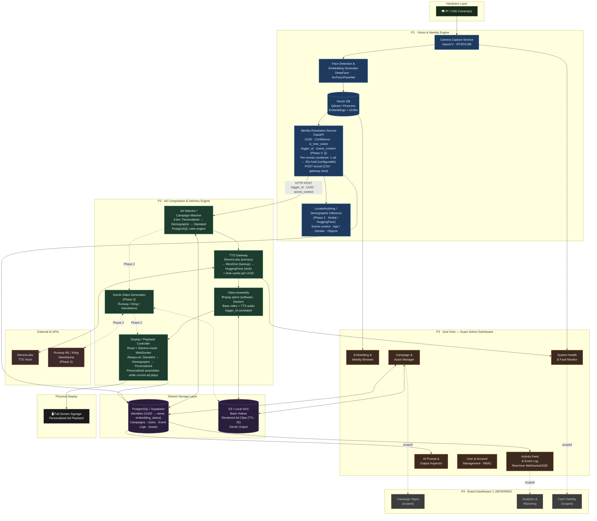
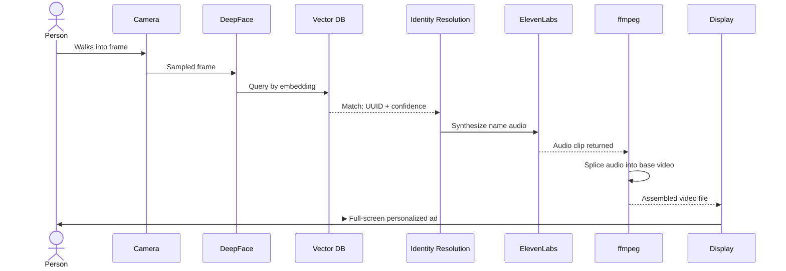
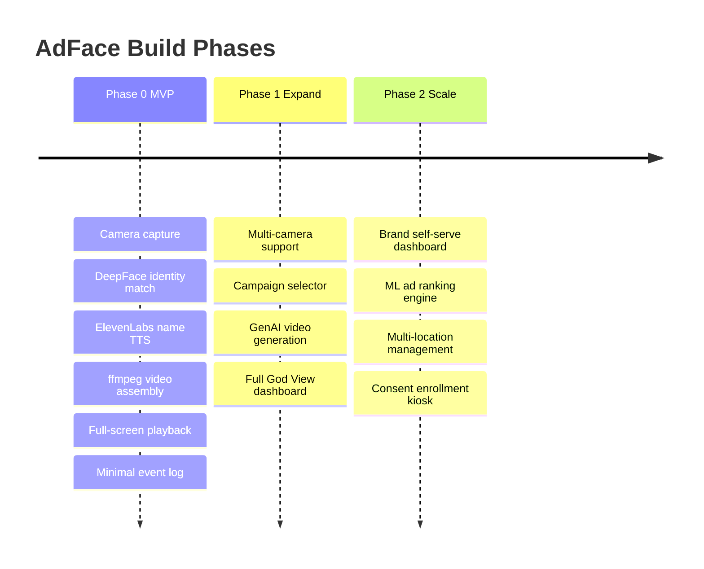

# AdFace — System Architecture Diagram

## Full System Architecture

---

## MVP Phase 0 — Data Flow Only

> The critical path for your first public demo.

---

## Build Phase Progression

---

## Architecture Decisions (CEO Review — 2026-06-05)

Key decisions locked during the plan-ceo-review. Do not re-litigate these without updating this doc.

| # | Decision | Rationale |
|---|----------|-----------|
| D1 | No event bus (Redis/NATS). Direct HTTP P1→P2. | Learning project; separate FastAPI processes already isolate event loops. Queue added in Phase 1 if burst handling needed. |
| D2 | Name stored in PostgreSQL `identities` table (UUID → name, embedding_status). Qdrant stores embeddings + UUIDs only. | PII belongs in a relational store with RBAC; vector DB is for similarity search only. |
| D3 | Enrollment Phase 0: CSV import via `POST /enroll` (`CSVEnrollmentSource`). Phase 1: `ReverseImageSearchGateway` stub (Google, Lenso.ai, PimEyes, EyeMatch.ai). | AbstractEnrollmentSource interface; stub raises `NotImplementedError` until Phase 1. |
| D4 | TTS Gateway: ElevenLabs (primary) → MisoOne (backup, build now) → HuggingFace (stub). Disk cache per UUID. | Single provider is a SPOF; fallback chain + cache survives API outages. |
| D5 | 3-tier always-on display: Standard (always) → Demographic (Phase 2, LocateAnything) → Personalized (named). Current ad keeps playing while personalized version assembles. | Display is never dark; personalized path hides assembly latency behind running content. |
| D6 | Per-screen dedup: 1 ad per UUID per screen, then a cooldown hold (`MAX_ADS_BEFORE_COOLDOWN`=1, `COOLDOWN_SECS`=30, both env-configurable). Keyed `screen_id:uuid`. In-memory Phase 0; Redis Phase 1. | Prevents back-to-back duplicate generation for someone standing in frame; cooldown is per-screen so the same person can trigger on a second screen independently. |
| D7 | Blocklist: P2 stops personalization (falls back to StandardAd). P1 still runs face detection and embedding for learning reps. | System gets training value; blocklisted person sees a standard ad, not a blank screen. |
| D8 | ffmpeg runs in Docker with software encoding (no VideoToolbox — macOS-only, unavailable in containers). Validate <3s empirically before building P2. See TODOS.md TODO-5. | Docker Compose uniformity for dev; M3 software encoding is fast enough for Phase 0 short clips. |
| D9 | `trigger_id` (uuid4) propagated across all services for correlation. `scene_context` field always present in P1→P2 payload; Phase 0 value is `{}`. | Observability — every log line traceable to originating detection. Scene context is Phase 2 (LocateAnything). |
| D10 | Background reconciliation task in P1-C4: every 60s, retry Qdrant writes for rows with `embedding_status='pending'` older than 5 minutes. | Prevents phantom enrollments from silent dual-write failures. |
| D11 | Supabase Auth with JWT custom claims for RBAC. Canonical roles: `Operator.SystemAdmin`, `Operator.SeniorSystemAdmin` (Phase 0). Full role set in `mras_ecosystem_and_users.md`. | Cheap, already in stack; JWT claims avoid per-request DB lookups for role checks. |

---

## Architecture Decisions (Engineering Review — 2026-06-05)

Key decisions locked or updated during the plan-eng-review. Do not re-litigate these without updating this doc.

| # | Decision | Rationale |
|---|----------|-----------|
| D1 (update) | P1→P2 HTTP call must be **fire-and-forget async** (`asyncio.create_task` or equivalent — do not await the response). | Blocking the identity resolution loop during P2 assembly halts camera processing for 3-5s. Non-blocking dispatch lets P1 immediately resume sampling frames. |
| D3 (update) | CSV enrollment supports **multiple photos per person** (embeddings averaged per UUID for better recognition accuracy). Response envelope: `{enrolled: N, updated: M, failed: [{row, name, reason, photo}]}`. Failure reasons: `no_face_detected`, `multiple_faces`, `low_quality`, `qdrant_write_failed`. **Duplicate detection**: enrollment checks PostgreSQL for existing UUID with same name before creating a new one; if found, new photos added to existing UUID (embeddings re-averaged). | Single-photo enrollment is a recognition failure point. Averaged embeddings improve match accuracy. Error envelope prevents silent failures at demo prep time. Dedup prevents phantom duplicate UUIDs from re-uploads. |
| D4 (update) | TTS disk cache key: `{uuid}_{voice_id}_{sha256(text_template)[:8]}`. If all TTS providers fail: assemble base video without audio overlay, fall back to StandardAd path, log `TTS_UNAVAILABLE` event to PostgreSQL. Never crash P2 on TTS failure. TTS pre-warm at startup is **permanently deferred** — at scale (10K enrolled × 100 campaigns = 1M API calls), startup pre-warming is impractical; cache warms organically per trigger. | UUID-only cache key serves stale audio when voice or template changes. Compound key eliminates that class of bugs. Bottom-of-chain fallback must be explicit. Pre-warm is economically unviable at target enrollment scale. |
| D5 (update) | **Walk-away policy (Phase 0):** play assembled ad even if person has left frame. **WebSocket reconnect:** P2-C5 reconnects with exponential backoff (1s→30s cap); if all reconnects fail, loop a local disaster fallback video file stored on the Electron host machine (path configured at deploy time, no network dependency). **Display-tier interrupt:** when personalized assembly completes, backend sends `interrupt` signal via WebSocket; P2-C5 fades out current ad in 500ms and plays personalized immediately. | Walk-away: simplicity wins for demo scale. Reconnect: 'always-on' requires explicit reconnect logic; local fallback ensures no dark screen. Interrupt: waiting for slot boundary could add up to 30s of delay — defeats the purpose of personalization. |
| D8 (update) | ffmpeg subprocess constraints: **max 1 concurrent ffmpeg per screen** (`asyncio.Semaphore(1)`), **10s subprocess timeout** (kill on timeout), **temp files cleaned up on success and failure**. Recommended flags: `-c:v libx264 -preset fast -c:a aac`. | Without a concurrency limit, simultaneous detections launch parallel ffmpeg processes that compete for CPU and may both exceed the latency budget. Timeout prevents hung ffmpeg from blocking the pipeline indefinitely. |
| D12 | **Identity confidence threshold ≥ 0.68** (ArcFace cosine similarity). Below threshold: `is_new_visitor=True`, falls back to demographic or standard ad. Threshold is a **remotely configurable parameter** (see D17). | Threshold must be explicit in architecture, not left to implementer discretion. 0.68 is the ArcFace-published 'confident match' baseline. Remotely tunable so false positive rate can be adjusted without per-host reconfiguration. |
| D13 | **DeepFace model pre-warmed at P1 service startup.** P1-C2 calls `DeepFace.represent()` with a dummy blank frame during startup, before the camera capture loop begins. | DeepFace lazy-loads model weights on first call (5-10s cold start). Without pre-warming, the first live detection triggers the freeze — unacceptable when the first impression is the demo. |
| D15 | **Frame sampling rate:** every 5th frame by default (6fps effective at 30fps camera). Configured via `FRAME_SAMPLE_RATE` env var. Must not exceed DeepFace processing throughput (~6-10fps on M3 MPS). | Processing every frame overwhelms DeepFace; the queue grows unbounded. At 6fps, DeepFace has 166ms per frame at comfortable margin. 1fps means up to 1s detection latency before a face is first seen. |
| D16 | **DeepFace backend:** MPS on M3 (dev/demo), CUDA on AWS GPU (Phase 1). Configured via `DEEPFACE_BACKEND` env var (values: `mps`, `cuda`, `cpu`). Default CPU is unacceptable for the latency budget. | MPS on M3 delivers ~150-200ms per embedding vs ~600-800ms on CPU. That difference alone can breach the 5s latency budget before any other component is counted. Cloud deployment switches to CUDA without code changes. |
| D17 | **Remote Config Service.** P3 exposes a `/config/v1/runtime` endpoint (backed by PostgreSQL). On-site systems poll every 20 minutes OR receive config pushes via the existing WebSocket channel. Applies to: `CONFIDENCE_THRESHOLD`, `FRAME_SAMPLE_RATE`, `DEDUP_COOLDOWN_SECONDS`, and all other tunable runtime parameters. No per-host manual reconfiguration required. | Runtime parameters must be centrally manageable across all deployed hosts. Polling at 20 min is low overhead. WebSocket push preferred where the connection is already live. |
| D18 | **P2 owns blocklist enforcement.** P2-C1 queries PostgreSQL on every trigger to determine blocklist status. P1 does not carry blocklist state in the trigger payload. P1 continues face detection and embedding for all detections regardless of blocklist status. | P1 focuses on identity resolution. Blocklist is an ad delivery policy that belongs in P2. P2 already queries PG for campaign selection; the blocklist check is one additional indexed lookup. |
| D19 | **Phase 0 event log = one generic `events` table:** `id bigserial, trigger_id uuid, ts timestamptz, service text, event_type text, status text, payload jsonb, asset_ref text null`. Indexed `(ts DESC)` and `(trigger_id)`. P1/P2/kiosk write rows; P3-C1 minimal feed reads them. Phase 0 emits `detection`, `tts_attempt`, `playback`; the deferred Phase 1 God View reads the **same** table with more `event_type`s. | One forward-compatible event sink avoids parallel per-phase tables (DRY) and lets the full God View land in Phase 1 with **zero schema migration or backfill**. `trigger_id` ties every event back to its originating detection (D9). `payload` JSONB absorbs type-specific fields without per-type columns. |

---

## Testing (Engineering Review — 2026-06-05)

**Frameworks:** pytest (all Python services: P1 + P2), Vitest + Testing Library (React/Electron P2-C5), Playwright (E2E).

**Must-have unit tests (Phase 0):**

| Test | Service | What to verify |
|------|---------|----------------|
| Confidence threshold boundary | P1-C4 | score=0.68 → match; score=0.67 → new_visitor |
| TTS cache hit / miss | P2-C3 | same (uuid, voice_id, text_hash) → disk served; different hash → API called |
| TTS full fallback chain | P2-C3 | EL fail + MisoOne fail → TTS_UNAVAILABLE, base video assembled, no P2 crash |
| Enrollment error envelope | P1-C4 | bad-photo row → failed[{row, reason}]; valid rows → enrolled; re-upload same name → updated |
| ffmpeg timeout + cleanup | P2-C2 | subprocess killed at 10s; temp file deleted; Semaphore(1) blocks second call until first completes |
| Qdrant reconciler | P1-C4 | pending > 5min + mocked Qdrant down → stays pending; Qdrant up → status=complete |
| Blocklist enforcement in P2 | P2-C1 | trigger with blocklisted UUID → StandardAd selected; PG query confirmed |
| WebSocket reconnect | P2-C5 | WS disconnect → exponential backoff fires; after N failures → local fallback video plays |

**Must-have E2E test (Phase 0):**

Playwright: enroll a known photo via CSV → feed a matching test frame to P1 → verify WebSocket trigger fires → verify assembled video file exists within 5s.

---

## NOT in scope (Phase 0)

| Item | Rationale |
|------|-----------|
| TTS pre-warming at startup | Scale: 10K enrolled × 100 campaigns = 1M API calls; cache warms organically per trigger |
| Walk-away / still-in-frame cancellation | Phase 0 policy: play anyway; revisit at Phase 1 |
| Redis-backed dedup | Phase 1 (TODO-1); in-memory is sufficient for single-process demo |
| AWS GPU deployment profile | Phase 1 (TODO-2) |
| P1→P2 burst handling / asyncio queue | Phase 1 (TODO-3) |
| Electron kiosk watchdog | Phase 1 (TODO-4) |
| Demographic inference (LocateAnything) | Phase 2 |
| GenAI video generation | Phase 2 |
| Brand self-serve dashboard (P4) | Deferred pending business model confirmation |
| Campaign selector (multi-template) | Phase 1 |
| Full God View dashboard (all P3 components) | Phase 1; Phase 0 delivers P3-C1 minimal only. Full Phase 1 scope captured below. |
| Remote control of live edge systems (kiosk restart, ffmpeg kill, force re-enroll) | Phase 1 God View; high blast radius — needs audit trail + `Operator.SeniorSystemAdmin` gate |
| Remote runtime-config admin UI (D17) | Phase 1 God View; D17 endpoint exists, the operator-facing config UI is deferred |
| Gaze / eye-tracking attention capture | Phase 2; `events` table reserves a `gaze` event_type, capture pipeline not built |
| GenAI video generation inspector | Phase 2; the generation-attempt inspector abstraction covers it when GenAI lands |

---

## What already exists

All Phase 0 components use pre-existing tools — nothing built from scratch:

| Tool | Used for |
|------|----------|
| DeepFace (Python) | Face detection + ArcFace/FaceNet embedding extraction |
| Qdrant | Vector similarity search |
| ElevenLabs API | TTS voice synthesis |
| ffmpeg | Audio-video splicing |
| PostgreSQL / Supabase | Relational storage + Auth |
| React + Electron | Kiosk display controller |

---

## Failure Modes

| Code path | Failure scenario | Test covers? | Error handling? | Visible to user? |
|-----------|-----------------|-------------|-----------------|-----------------|
| DeepFace.represent() cold start | 5-10s model load spike | YES (pre-warm test) | YES (pre-warm at startup) | No — happens before camera loop |
| Qdrant dual write at enrollment | Silent Qdrant write failure | YES (reconciler test) | YES (D10 reconciler) | Person not recognized until reconciler resolves |
| All TTS providers fail | EL + MisoOne + HuggingFace all down | YES (full fallback chain test) | YES (base video served, TTS_UNAVAILABLE logged) | Standard ad plays; no name call-out |
| ffmpeg subprocess hangs | Subprocess exceeds 10s | YES (timeout test) | YES (kill + temp cleanup) | Ad not delivered; next trigger starts fresh |
| WebSocket connection drops | Network blip during demo | YES (reconnect test) | YES (backoff + local fallback video) | Local fallback loops; invisible if reconnect < 30s |
| Qdrant down during live detection | QdrantException on similarity query | **NO — critical gap** | **NO — unspecified** | P1 crash or infinite retry; detection halts |
| Second concurrent ffmpeg blocked | Semaphore(1) queues second assembly | YES (Semaphore test) | YES (queued, not dropped) | Second ad delayed but assembled correctly |
| Bad photo in enrollment CSV | No face detected in uploaded photo | YES (enrollment error test) | YES (error envelope returned) | Operator sees failed[] in API response |

**Critical gap:** Qdrant down during live detection has no test AND no specified error handling. P1 needs explicit `try/except QdrantException → log + fallback to new_visitor=True` in the detection loop. Flag for Phase 0 implementation.

---

## P3 God View (mras-ops) — Phase 1 Scope (captured 2026-06-05, eng review)

mras-ops is the platform operator's **primary administrative + observability surface** (`Surface.Administration` in `mras_ecosystem_and_users.md`). Phase 0 ships only **P3-C1 minimal activity feed** — the demo personalization loop (P1→P2→display) is sequenced first. Everything below is **Phase 1**, recorded now so it isn't a cold start.

**Stack:** React + Vite + TypeScript + **shadcn/ui** (Tailwind). Reference UX in `/Users/jn/Documents/mras_example_god_view`: dark theme, left icon rail, multi-pane layouts (filter list │ metric cards │ detail table + time-series), an investigation-canvas activity feed, confidence callouts, critical/secondary badges, and a review/approval workflow with embedded video-frame thumbnails.

**Data access rule (read-mostly control plane):** the God View reads the `events` table (D19) + S3/NAS assets + each service's `/health` endpoint. It **never taps service internals**.

> **Architecture correction (supersedes the drawn diagram):** the mermaid taps `P1C1` (camera) and `P2C3` (TTS) directly into `P3C4` (lines ~96-98). That couples the dashboard to capture/TTS internals — a God View query could stall the camera loop. Phase 1 must rewire P3 to read `events` + assets + `/health` only. Update the diagram when Phase 1 begins.

**Capabilities (Phase 1 unless noted):**

| Component | What it does | Source |
|-----------|--------------|--------|
| P3-C1 Activity feed (Phase 0) | Real-time event stream (WebSocket/SSE) | `events` table |
| Vision inspector | Every detection success **and** failure: confidence, frame thumbnail, match vs `new_visitor`; objects when Phase 2 LocateAnything lands | `events` (`detection`) + S3 frames |
| Generation inspector (P3-C2) | One generic "generation attempt" view: TTS attempts now (provider, cache hit/miss, success/failure) and GenAI video prompts/outputs later (Runway/Kling/Nanobanana/Midjourney) — same abstraction | `events` (`tts_attempt`, future `genai_attempt`) + S3 |
| Playback monitor | What played, when, duration, per screen. Schema reserves `gaze`/attention for Phase 2 eye-tracking (did they watch, how much) — capture not built now | `events` (`playback`, future `gaze`) |
| System health & fault monitor (P3-C4) | Per-service health + failure-event rollups | `/health` + `events` (status=failure) |
| Embedding & identity browser (P3-C3) | Read-only browse of enrolled identities; merge/edit deferred | PG `identities` + Qdrant (read) |
| Remote admin — low blast radius | Runtime config (`CONFIDENCE_THRESHOLD`, `FRAME_SAMPLE_RATE`, `DEDUP_COOLDOWN_SECONDS`) via the existing D17 channel | D17 `/config/v1/runtime` |
| Remote admin — high blast radius | Kiosk restart, ffmpeg kill, force re-enroll — every action audited to `events` + gated behind `Operator.SeniorSystemAdmin` (D11) | control endpoints + audit |
| User & account mgmt / RBAC (P3-C5) | Supabase Auth/JWT, `Operator.SystemAdmin` / `Operator.SeniorSystemAdmin` (D11) | Supabase |
| Campaign & asset manager (P3-C6) | Manage campaigns + base/rendered assets | PG + S3 |

**Key insight:** the hard, valuable part is the **event contract (D19)**, not the dashboard. Once P1/P2/kiosk emit structured success/failure events, the God View is mostly shadcn tables + charts + a WebSocket feed over that contract. Build the contract first; the UI follows cheaply.
