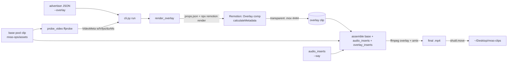

# Phase 0.5 — Advertiser-Authored Animated Text Overlays (Remotion → ffmpeg)

## Context

Why this exists: the composer can mix personalized spoken audio into ad clips, but its only
on-screen text is the ffmpeg `drawtext` overlay (`overlay_text` in `assembler.py`) — a static,
ugly look the user explicitly rejected. The `--draw MS TEXT` CLI directive is parsed but only
logged (`log_draw_directives`), never rendered (confirmed in SESSION_LOG, 2026-06-08). The user
wants advertisers to add text that animates CapCut / After-Effects-style (warp like a snake,
turbulence, kinetic typography), driven by code/templates parameterized via JSON, and already
built a rough Remotion prototype (`/Users/jn/code/Remotions/remotion-text-demo`) that warps text
on a transparent background via SVG `feTurbulence` + `feDisplacementMap` and `spring`/`interpolate`.

Outcome of this phase: a **host-CLI tracer bullet, fully built end-to-end**. A parameterized
Remotion template renders a **transparent animated overlay**; the Python composer composites it onto
a base pool clip via the ffmpeg `overlay` filter with correct timing. Output goes to
`~/Desktop/mras-clips` (unchanged convention). It proves the whole pipeline without touching the
kiosk/live `/trigger` path.

**Scope (confirmed with user):** implement **all three milestones (M0–M2)** in this pass, built in
**fade-first order** — prove transparency-compositing + timing on the simple `fade` preset, then add
`turbulence-warp` + styling, then multiple overlays per clip. Each milestone is an independently
shippable PR.

## Repo reality (read before starting)

This planning doc lives in the **architecture/docs repo** (`minority_report_architecture`, the repo
cloned into this session). The actual code changes land in **two sibling repos that are NOT checked
out here** and must be worked locally:
- `mras-composer` (existing Python) — `/Users/jn/code/mras-composer`
- `mras-overlays` (**new** Node/Remotion repo to create) — `/Users/jn/code/mras-overlays`

Before coding, **ffprobe the real pool clips** in `mras-ops/assets/*.mp4` to confirm their
dimensions/fps (the draft assumed 854×480/24fps — treat that as illustrative; the pipeline derives
the real values dynamically). Per CLAUDE.md §5/§6: work on a branch/worktree per milestone, TDD
red→green, one PR per milestone, and **prepend a SESSION_LOG entry** when done.

## Decisions (locked)

- **Engine: Remotion** (React + headless Chromium; JSON props via zod). `@remotion/three` available later for 3D/GL.
- **Authoring: preset templates + JSON props** for 0.5. Arbitrary advertiser code is a later phase.
- **Code location: new sibling repo `mras-overlays`** (Node) — keeps the Python composer image Node-free.
- **Target: host CLI preview only.** No kiosk/live wiring (per-trigger headless-Chromium render is too slow for live; that's the Docker/sidecar + caching later phase).
- **Transparency format: ProRes 4444 `.mov`** (`yuva444p10le`, straight alpha — what ffmpeg `overlay` expects). WebM/VP9-alpha and PNG-sequence are documented fallbacks, not built.

## Architecture



The composer stays Python and only **composites** a pre-rendered transparent clip. Remotion runs as a
host subprocess (`npx remotion render`) located via env `MRAS_OVERLAYS_DIR`
(default `/Users/jn/code/mras-overlays`).

**Resolution/fps/duration matching:** the overlay must match the base. Its dimensions/fps/duration
come from props via Remotion `calculateMetadata` (no hardcoded size). The CLI ffprobes the base and
passes `baseWidth/baseHeight/fps/durationMs`; `durationInFrames = round(durationMs/1000 * fps)` and the
overlay clip's length equals the **overlay window** (`durationMs`), not the base duration.

## New repo: `mras-overlays` (Remotion)

Pin to the prototype's stack (Remotion 4.0.473, React 19, zod). Single-purpose; drop demo scaffolding.

```
mras-overlays/
  package.json            # remotion 4.0.473, react 19, zod, @remotion/google-fonts
  remotion.config.ts
  src/index.ts            # registerRoot
  src/Root.tsx            # <Composition id="Overlay"> + calculateMetadata (size/fps/duration from props)
  src/schema.ts           # zod overlaySchema — mirrors Python OverlaySpec + base-meta fields
  src/Overlay.tsx         # transparent AbsoluteFill; switch on `preset`
  src/presets/Fade.tsx           # opacity in/out + spring scale/drift (reuse prototype spring/interpolate)
  src/presets/TurbulenceWarp.tsx # port feTurbulence + feDisplacementMap from prototype HelloWorld.tsx
  src/fonts.ts            # @remotion/google-fonts (deterministic; never system fonts)
```

Render command (props via temp file to avoid shell escaping — mirrors the composer's existing
`drawtext textfile=` trick):
```
npx remotion render src/index.ts Overlay <out.mov> \
  --props=<props.json> --codec=prores --prores-profile=4444 --log=error
```

**Reuse the technique, not the files** from
`/Users/jn/code/Remotions/remotion-text-demo/src/HelloWorld.tsx` (feTurbulence/displacement warp,
`spring`, `interpolate`, transparent `AbsoluteFill`) and the zod-schema/`defaultProps` pattern in its
`Root.tsx`.

## Composer changes (`mras-composer/src/assembly/assembler.py`)

Extend `assemble()` with overlay inputs; **leave `_audio_filter` and audio input ordering untouched**
so existing `test_assembly.py` stays green.

```python
async def assemble(base_video, audio_inserts, trigger_id,
                   overlay_text=None,
                   overlay_inserts: Optional[list[tuple[Path, int, int]]] = None) -> Path:
    # overlay_inserts = (transparent_clip, start_ms, end_ms)
```

- **Input order:** base `0`, audio inserts `1..N` (unchanged), overlay clips `N+1..N+V`.
- **New `_video_filter(overlay_inserts, start_index)`** chains each overlay: shift to its start with
  `setpts`, gate with `enable='between(...)'`, and **require `eof_action=pass`** (base shows again
  after the overlay's frames end). Overlays are full-frame at base resolution (Remotion baked
  text/position), so ffmpeg only does timing + alpha — `overlay=0:0`.
- **Branch precedence (mutually exclusive in 0.5):** `overlay_inserts` → video chain (ignore legacy
  `overlay_text`); else `overlay_text` → existing drawtext; else passthrough `-map 0:v`.
- Output codec unchanged (`libx264`/`yuv420p`, `aac`); final mp4 has no alpha.

Representative `filter_complex` — one overlay (base=0, audio=1, overlay=2), 0.5s–2.5s:
```
[2:v]setpts=PTS+0.5/TB[ov0];
[0:v][ov0]overlay=0:0:eof_action=pass:enable='between(t,0.5,2.5)'[v0];
[1:a]adelay=250|250[a1];[0:a][a1]amix=inputs=2:duration=first[a]
```
`-map "[v0]" -map "[a]"`. Two overlays chain `[v0]→[v1]` with both clips added as `-i`.

## CLI changes (`mras-composer/src/cli.py`)

New package `src/overlay/` holds `spec.py`, `probe.py`, `renderer.py`.

Flow in `run()`:
1. `parse_overlay_specs(args.overlay, args.draw)` → `list[OverlaySpec]`.
2. `probe_video(base)` (ffprobe) → `VideoMeta(width, height, fps, duration_ms)`.
3. Per spec: `render_overlay(spec, base_meta, work_dir, runner=subprocess.run)` → transparent `.mov`;
   clamp `end_ms = min(start+duration, base_duration)`; collect `(clip, start_ms, end_ms)`.
4. `assemble(base, audio_inserts, trigger_id, overlay_inserts=...)`.
5. `shutil.move` → `~/Desktop/mras-clips/{trigger_id}.mp4`; honor `--open` (existing behavior, reuse
   `resolve_output_path`).
6. Stop calling `log_draw_directives` (remove it in the same red→green commit that wires `--draw`).

**Flags:** add `--overlay JSON` (repeatable). Keep `--draw MS TEXT` as back-compat sugar mapping to
`OverlaySpec(text, start_ms=MS, duration_ms=DEFAULT, preset="fade")`.

`render_overlay` builds props (`text, preset, color, position, fontSize, fontFamily, baseWidth,
baseHeight, fps, durationMs`), writes a temp `props.json`, runs the `npx remotion render
--props=<file> --codec=prores --prores-profile=4444` argv in `MRAS_OVERLAYS_DIR` via an **injectable
runner** (tests pass a fake). Render runs **outside** the assemble semaphore with its own timeout.

## Overlay spec / directive schema

`src/overlay/spec.py` — frozen dataclass `OverlaySpec`: `text`, `start_ms`, `duration_ms`
(→ `end_ms`), `preset` ∈ {`fade`, `turbulence-warp`}, `color="#ffffff"`, `position` ∈
{`top`,`center`,`bottom`}, `font_size=96`, `font_family="Inter"`.

`--overlay` JSON is **camelCase** (1:1 with the zod schema); `parse_overlay_specs` normalizes to
snake_case and validates (bad JSON / unknown preset / negative start → raise early). Example:
```
--overlay '{"text":"LIMITED TIME","startMs":500,"durationMs":2000,"preset":"turbulence-warp","color":"#ff2d2d","position":"top"}'
```

## Reused existing code (don't reinvent)

- `assembler.py`: `_audio_filter`, the `Semaphore(1)` + `asyncio.create_subprocess_exec` + `_TIMEOUT`
  pattern, and the `drawtext textfile=` escaping trick (reuse for props-via-file).
- `cli.py`: `build_parser`, `parse_items`, `resolve_output_path`, `default_assets_dir`, `--open`, and
  the `~/Desktop/mras-clips` output convention.
- Prototype warp technique + zod/`defaultProps` pattern (`HelloWorld.tsx`, `Root.tsx`).
- Test patterns: capture `create_subprocess_exec` args and assert on `filter_complex` substrings
  (`tests/test_assembly.py`); `tmp_path`/`caplog` CLI tests (`tests/test_cli.py`).

## TDD task breakdown (staged, red→green, each a shippable PR)

**Milestone 0 — Tracer bullet: single `fade` overlay, host CLI, end-to-end**
1. `mras-overlays` scaffold: `Overlay` comp + `fade` preset, zod schema, `calculateMetadata`,
   google-fonts. Verify a manual `.mov` 4444 render. (Node; gated by smoke render, not pytest.)
2. `src/overlay/probe.py` `probe_video` — unit (mock ffprobe; handle `24/1`, fractional `30000/1001`).
3. `src/overlay/spec.py` `OverlaySpec` + `parse_overlay_specs` — unit (happy + edge/back-compat).
4. `src/overlay/renderer.py` `render_overlay` (injectable runner) — unit (argv has `--codec=prores`,
   `--prores-profile=4444`, comp id `Overlay`; props file fields correct).
5. `assembler.py` `overlay_inserts` + `_video_filter` single-overlay chain — unit (filter substrings,
   input indexing, `eof_action=pass` regression guard; existing `test_assembly.py` stays green).
6. `cli.py` `--overlay` + `--draw` back-compat → render → assemble → `~/Desktop/mras-clips`; remove
   `log_draw_directives` — unit (mock renderer + assemble).
7. **E2E smoke** (below) — proves the bullet.

**Milestone 1 — Turbulence/warp preset + styling:** add `turbulence-warp` (port prototype), wire
`color/position/fontSize/fontFamily`, preset enum validation; tests + a warp smoke render.

**Milestone 2 — Multiple overlays per clip:** `_video_filter` multi-overlay chaining (`[v0]→[v1]…`),
repeated `--overlay`, end-clamp to base duration; chaining/indexing tests.

## Verification (end-to-end)

- **Unit:** `python -m pytest` (host, asyncio_mode=auto) — new `tests/test_overlay_assembly.py`,
  `tests/test_overlay_renderer.py`, `tests/test_overlay_probe.py`, extended `tests/test_cli.py`.
  Existing `test_assembly.py`/`test_cli.py` remain green.
- **E2E smoke** `tests/test_overlay_e2e.py` (`@pytest.mark.slow`, host-only, excluded from default run):
  real `npx remotion render` of a short `fade` overlay at base dims/fps → real `assemble` over a real
  `mras-ops/assets` clip → ffprobe output is `h264/yuv420p` (no alpha leaked) → extract a frame inside
  the window (`start+0.5s`) and assert pixels **differ** from the base frame in the overlay region, and
  a frame **after** the window **matches** base (guards `eof_action=pass`).
- **Manual:** `python -m src.cli --overlay '{"text":"LIMITED TIME","startMs":500,"durationMs":2000,"preset":"turbulence-warp","color":"#ff2d2d","position":"top"}' --open`
  → eyeball the clip in `~/Desktop/mras-clips`.

## Risks & mitigations

- **Render latency** (headless Chromium = seconds→tens of seconds): acceptable for host CLI preview;
  keep render outside the assemble semaphore. Live/kiosk needs caching + warm server (later phase).
- **Premultiplied vs straight alpha:** ProRes 4444 from Remotion should be straight (what `overlay`
  wants); watch for edge halos in the smoke; if haloed, adjust overlay alpha handling.
- **Font determinism:** `@remotion/google-fonts` / bundled `@font-face` — never system fonts.
- **Res/fps/duration matching:** solved via ffprobe→props→`calculateMetadata`; clamp overlay window to
  base duration; ensure even dimensions; watch VFR / fractional `r_frame_rate`.

## Explicitly LATER phases (NOT in 0.5)

- **Full custom-code authoring** (advertisers supply arbitrary Remotion/React components) — needs a
  separate plan incl. sandboxing/running untrusted code safely.
- **Production / Docker path:** a containerized Node **overlay render service / sidecar** the composer
  calls over HTTP (image stays Node-free), with **spec-hash caching** (static per-ad overlays render
  once; only personalized per-viewer text re-renders) and possibly `@remotion/lambda` for burst. Wire
  into live `/trigger` + kiosk only after this exists.

## Critical files
- New repo: `/Users/jn/code/mras-overlays/**` (Remotion).
- `/Users/jn/code/mras-composer/src/assembly/assembler.py` — `assemble()` + new `_video_filter`.
- `/Users/jn/code/mras-composer/src/cli.py` — `--overlay`/`--draw`, render→assemble flow.
- `/Users/jn/code/mras-composer/src/overlay/{spec,probe,renderer}.py` — new.
- `/Users/jn/code/mras-composer/tests/{test_overlay_assembly,test_overlay_renderer,test_overlay_probe,test_overlay_e2e}.py`, extend `tests/test_cli.py`.
- This plan doc → commit into `minority_report_architecture/docs/superpowers/plans/`.
- Reference only: `/Users/jn/code/Remotions/remotion-text-demo/src/HelloWorld.tsx`, `Root.tsx`.

## Closing checklist (per CLAUDE.md §5/§6)
- Branch/worktree per milestone; TDD red→green proven by running; one PR per milestone; remaining
  unchecked items filed as GitHub issues.
- Prepend a dated SESSION_LOG entry citing `mras-composer@sha` / `mras-overlays@sha`, the new
  `MRAS_OVERLAYS_DIR` operational note, and the Remotion render command.
